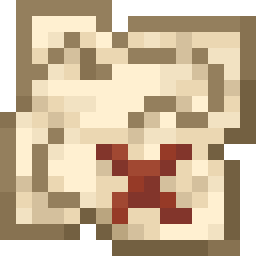

<p align="center">
  
</p>

<h1 align="center">PolyQuest</h1>

<p align="center">
  <strong>PolyQuest - Data-driven daily and one-time quests.</strong>
</p>

<p align="center">
  <a href="https://github.com/RenardElectric/polyquest/releases/latest"></a>
  
  
  
  <a href="LICENSE.txt"></a>
</p>

<p align="center">
  <a href="#what-you-can-do">What you can do</a> ·
  <a href="#start-playing">Start playing</a> ·
  <a href="#quests-and-rewards">Quests &amp; rewards</a> ·
  <a href="#server-administrators">Server admins</a> ·
  <a href="#developers">Developers</a>
</p>

PolyQuest is a server-side Fabric quest engine. Servers define their own daily and permanent quests in
datapacks, and players browse objectives, follow progress and claim rewards through an inventory-style
quest journal.

> [!NOTE]
> **Just joining an existing PolyQuest server?** You can ignore the
> [server administrator](#server-administrators) and [developer](#developers) sections.

## What you can do

| Functionality                    | What it means in-game                                                                                         |
|----------------------------------|---------------------------------------------------------------------------------------------------------------|
| **Complete daily quests**        | Each day can offer one easy, one medium and one hard quest shared by every player on the server.              |
| **Take on unique quests**        | Permanent, one-time objectives never rotate, and each reward can be claimed once.                             |
| **Progress through normal play** | Quests can react to item deliveries, fishing, combat, exploration, crafting, item use, advancements and more. |
| **Follow multi-step objectives** | A quest can combine goals into sequences, choices, repeats, time limits and other composite challenges.       |
| **Browse a quest journal**       | An inventory-style menu shows each quest's objective, progress, availability, expiry and rewards.             |
| **Claim useful rewards**         | Completed quests can award items, experience, economy currency or server-defined command rewards.             |
| **Play without a client mod**    | Quest logic and menus run on the server; multiplayer players do not need the PolyQuest JAR.                   |

PolyQuest is an engine rather than a built-in quest pack. The server decides which quests and rewards
are available.

## Start playing

### Joining a multiplayer server

1. Add the server in Minecraft and connect as usual.
2. Find the server's **Quest Giver** and interact with it to open the quest journal.
3. Select a daily quest, or open the book in the journal to browse unique quests.
4. Read the objective and reward, then complete the requested activity in the world.
5. Return to the journal and click the glowing completed quest to claim its reward.

If the journal is empty or there is no Quest Giver, ask a server administrator whether PolyQuest quests
and the NPC have been configured.

### Playing in singleplayer

Singleplayer runs its own local server, so PolyQuest must be installed in your Fabric game instance and
the world must have a compatible quest datapack. Follow [Installing PolyQuest](#installing-polyquest),
then see [Adding quests](#adding-quests).

### Using the quest journal

- The main journal shows the current easy, medium and hard daily quests.
- The **Unique Quests** book opens the collection of permanent one-time objectives.
- Quest icons show the title, objective, progress, reward, availability and claim status.
- Click a completed, unclaimed quest to deliver any required items and receive the reward.
- Daily quests expire at the next midnight in the server's configured time zone. Incomplete and
  unclaimed daily progress is discarded when the rotation changes.
- Unique quests never expire, and a successfully claimed reward cannot be claimed again.

> [!IMPORTANT]
> Quest attempt progress is not saved across server restarts. Successful claims, pending reward
> deliveries and administrator rerolls are saved with the world.

## Quests and rewards

### Built-in objectives

| Objective type                  | Example use                                                                                |
|---------------------------------|--------------------------------------------------------------------------------------------|
| Minecraft advancement criterion | React to any registered advancement trigger using its native, trigger-specific conditions. |
| Consume items                   | Deliver a quantity of matching items when claiming.                                        |
| Obtain an advancement           | Complete a specified advancement.                                                          |
| Explicit signal                 | Let another server system advance a quest by signal ID.                                    |

Most gameplay objectives use `polyquest:advancement_criterion`. Its `trigger` and `conditions` fields
are decoded by Minecraft exactly like one criterion inside a vanilla advancement, but PolyQuest creates
the temporary listener directly from the quest; a separate advancement JSON file is not required.

For example, this condition completes when the player kills a zombie:

```json
{
  "type": "polyquest:advancement_criterion",
  "trigger": "minecraft:player_killed_entity",
  "conditions": {
    "entity": {
      "type": "minecraft:entity_properties",
      "entity": "this",
      "predicate": {
        "minecraft:entity_type": "minecraft:zombie"
      }
    }
  }
}
```

The `conditions` object depends on the selected trigger and follows Minecraft's advancement format.
Older `fish_item`, `kill_entity`, `break_block`, `visit_location`, `player_death` and
`uninterrupted_fall` condition types are no longer registered.

Objectives can be combined with `all_of`, `any_of`, `repeat`, `sequence`, `time_window`, `n_of_m`,
`optional` and `choice` conditions. Server datapacks control the exact targets, counts and rules.

### Built-in rewards

| Reward type         | What it gives                                                                |
|---------------------|------------------------------------------------------------------------------|
| Economy currency    | Delivers a configured currency reward through the player's default account.  |
| Items               | Adds the configured item stack, dropping any remainder beside the player.    |
| Experience          | Gives a configured number of experience points.                              |
| Server commands     | Runs configured commands with `{player}` and `{uuid}` placeholders.          |

Economy rewards require a Common Economy-compatible provider for the configured currency. If a reward
cannot be delivered temporarily, PolyQuest stores the pending claim and retries it.

---

## Server administrators

This section is for people installing PolyQuest in singleplayer or running a multiplayer server. Players
joining an existing server can return to [Start playing](#start-playing).

### Requirements

| Component                   | Current requirement                                                |
|-----------------------------|--------------------------------------------------------------------|
| Minecraft                   | `26.3`                                                             |
| Java                        | `25` or newer                                                      |
| Fabric Loader               | `0.19.5` or newer                                                  |
| Fabric API                  | `0.161.0+26.3` or newer compatible build                           |
| SGUI, PolyCore and CE API   | Bundled inside the PolyQuest JAR; no separate download is required |

A separate Common Economy provider is required only when a quest uses an economy reward.

### Installing PolyQuest

1. Install Java 25.
2. Install the Minecraft 26.3 version of [Fabric Loader](https://fabricmc.net/use/) for your game or
   dedicated server.
3. Open that game instance or server directory and create a folder named `mods` if it is not present.
4. Download [Fabric API](https://modrinth.com/mod/fabric-api) and place its JAR in the `mods` folder.
5. Download PolyQuest from [GitHub Releases](https://github.com/RenardElectric/polyquest/releases) and
   place its main JAR in the same `mods` folder.
6. Add or create a quest datapack for the world.
7. Start the game or server, then use `/polyquest pnj` as a Gamemaster to create a Quest Giver.

For singleplayer, follow these steps in the Fabric Minecraft instance you intend to play. For a
multiplayer server, install PolyQuest and Fabric API on the server; connecting players do not need the
PolyQuest JAR.

### Client compatibility and assets

The quest journal uses vanilla inventory menus and item icons, so no client mod is required. PolyQuest
also includes a custom Quest Giver skin asset. Include the matching asset in the server resource pack
if server-only clients should see that custom skin instead of a missing or fallback texture.

### Adding quests

PolyQuest reads three JSON resource collections from enabled datapacks:

| Datapack path                                    | Purpose                                                        |
|--------------------------------------------------|----------------------------------------------------------------|
| `data/<namespace>/quests/`                       | Daily and unique quest definitions                             |
| `data/<namespace>/quest_templates/`              | Reusable parameterized quest prototypes                        |
| `data/<namespace>/reward_profiles/`              | Reusable reward lists                                          |

Daily quests require an `easy`, `medium` or `hard` difficulty. PolyQuest deterministically selects one
quest for each difficulty and rotates them at midnight in the configured time zone. Unique quests are
permanent and have no difficulty.

Use the [JSON schemas](schemas) as the authoritative field reference. For an
`advancement_criterion`, the schema accepts any object under `conditions` because its fields depend on
the selected Minecraft trigger; `/reload` still decodes and validates that object through Minecraft's
criterion codec. A `polyquest:money` reward requires `amount`, `formatted_amount` and `currency`.

Run vanilla `/reload` after changing resources. PolyQuest validates the entire candidate catalog before
publishing it; if any quest, template or reward profile is invalid, the previous working catalog stays
active and the errors are written to the server log.

### Configuration

PolyQuest creates `config/polyquest.json` with these server-wide settings:

| Setting                     | Default              | Purpose                                                             |
|-----------------------------|----------------------|---------------------------------------------------------------------|
| `dailySeed`                 | Built-in stable seed | Changes the deterministic daily selections.                         |
| `timeZone`                  | Host system zone     | Sets the local midnight used for daily rotation.                    |
| `pendingRewardRetrySeconds` | `30`                 | Sets how often temporarily undeliverable rewards are retried.       |

Use a Java/IANA time-zone ID such as `Europe/Zurich` for `timeZone`. Restart the server after editing
the configuration file.

### Administrative commands

| Command                                  | What it does                                                                 |
|------------------------------------------|------------------------------------------------------------------------------|
| `/polyquest`                             | Show the installed PolyQuest version, author and description.                |
| `/polyquest help`                        | List the commands available to the command source.                           |
| `/polyquest gui`                         | Open your quest journal directly.                                            |
| `/polyquest pnj [<pos> <yaw> <pitch>]`   | Spawn an immovable Quest Giver at you or at the supplied position.           |
| `/polyquest list [player]`               | List available quests and their claim states for yourself or another player. |
| `/polyquest inspect <quest> [player]`    | Show objective, reward, progress, occurrence and diagnostic details.         |
| `/polyquest claim <quest> [player]`      | Claim a completed quest or retry a pending reward for an online player.      |
| `/polyquest reset <quest> [player]`      | Reset a quest attempt and its claim state.                                   |
| `/polyquest reroll [easy\|medium\|hard]` | Reroll one daily slot, or all three when the difficulty is omitted.          |
| `/polyquest signal <id> [player]`        | Emit a configured explicit quest signal for one or more online players.      |

All PolyQuest subcommands use Minecraft's **Gamemasters** permission level. Arguments provide tab
completion where applicable.

### Stored data

- Successfully claimed quest occurrences, pending reward transactions and daily reroll generations are
  persistent world data under PolyQuest's `ledger` entry.
- Attempt progress is intentionally session-only and is lost when the server restarts.
- Daily incomplete and ready-to-claim states are discarded when the configured date changes.
- Online players are notified when the daily rotation changes; players who were away receive the
  same clickable notice when they next join that day.
- Quest reloads preserve completed claims and pending rewards. Cosmetic edits keep live progress;
  behavior-changing edits reset progressed attempts and notify affected players.
- Back up the world and configuration as usual before removing the mod or moving a save between
  incompatible versions.

---

## Developers

### Building from source

#### Prerequisites

- Git
- JDK 25
- No system Gradle installation is required; the repository includes the Gradle 9.7.1 wrapper.

Clone the repository:

```bash
git clone https://github.com/RenardElectric/polyquest.git
cd polyquest
```

<details open>
<summary><strong>Windows PowerShell</strong></summary>

```powershell
.\gradlew.bat build --stacktrace
```

</details>

<details>
<summary><strong>Linux / macOS</strong></summary>

```bash
chmod +x ./gradlew
./gradlew build --stacktrace
```

</details>

The `build` task compiles the mod, runs its configured tests and writes artifacts to `build/libs/`.

### Repository layout

| Path                               | Purpose                                                                     |
|------------------------------------|-----------------------------------------------------------------------------|
| `src/main/java/polycube/polyquest` | Quest runtime, conditions, rewards, commands, GUIs, reloads and persistence |
| `src/main/resources`               | Fabric metadata, access rules and packaged PolyQuest assets                 |
| `src/test`                         | Unit and schema contract tests                                              |
| `schemas`                          | JSON schemas for quests, templates, reward profiles and complete catalogs   |
| `examples`                         | Example quest, template and reward-profile resources                        |
| `docs`                             | Architecture, datapack, condition, claim, reload and rotation documentation |

Before submitting a change, run the build command above and confirm there are no errors.

## Authors and license

PolyQuest is made by **RenardElectric**.

This project is available under the [MIT License](LICENSE.txt).
